# Practical Example

Assume we have 5 participants that want to shuffle their **UTXO**s. Each
participant has a **UTXO** with the same **ERC20** tokens and **amount**, for
example 5 USDT tokens, and they want to shuffle them to 5 unknown addresses.

Lets name them **Alice**, **Bob**, **Charlie**, **David**, and **Eve**:

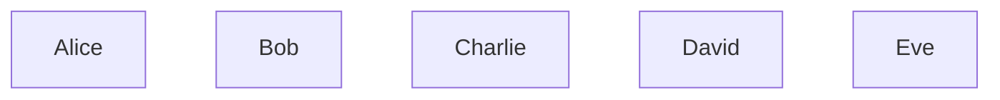

**Alice**, **Bob**, **Charlie**, **David**, and **Eve** want to send their
UTXOs to some 5 addresses, and they don't want to reveal receivers of that UTXOs
to anybody. So, for coordination, they will use a **service** which implements
**Coin Shuffle** protocol.

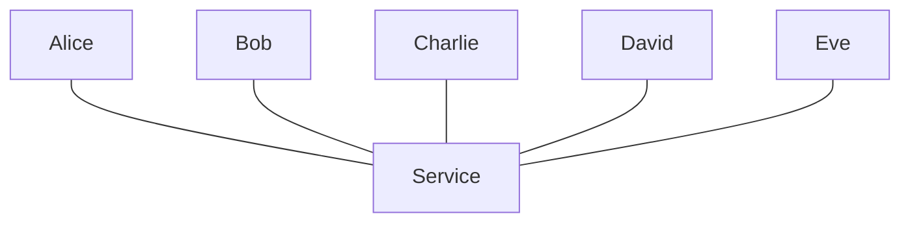

**Alice**, **Bob**, **Charlie**, **David**, and **Eve** will register in the
**service** by providing their **UTXO**s with proof of ownership.

Service will organize them into **queue** until enough participants will be
registered.

> In this example, we will assume that 5 participants are enough to shuffle.
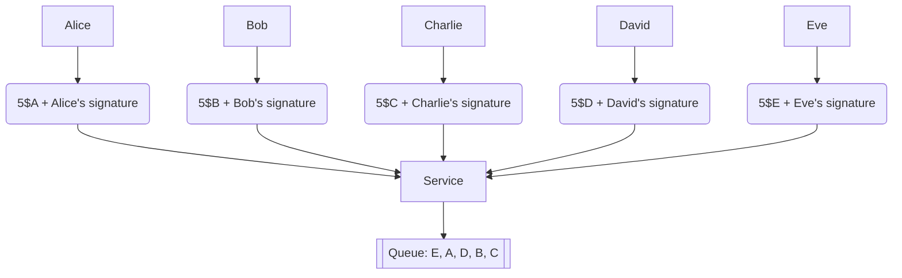

Then, when enough participants will be registered, **service** will form a **room**,
and notify about that participants, so they can send their RSA public keys.

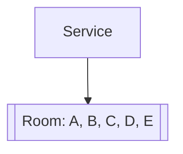

As the response, paritipants will send their RSA public keys to the **service**:

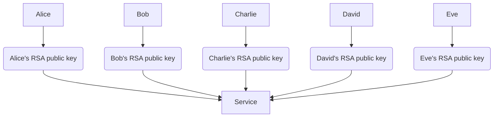

**Service** will define order of shuffling and send RSA public keys that are
required for **outputs** **encoding** and **decoding** to each participant:

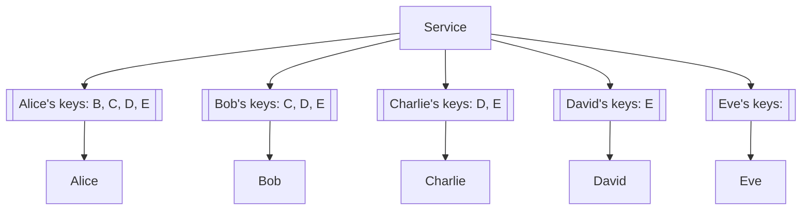

> Note, that each participant alread knows his own public key.

Table of **keys** that each participant has:

| Key / Participant | Alice | Bob | Charlie | David | Eve |
|-------------------|-------|-----|---------|-------|-----|
| Alice             | ✅    | ✅  | ✅      | ✅    | ✅  |
| Bob               | ❌    | ✅  | ✅      | ✅    | ✅  |
| Charlie           | ❌    | ❌  | ✅      | ✅    | ✅  |
| David             | ❌    | ❌  | ❌      | ✅    | ✅  |
| Eve               | ❌    | ❌  | ❌      | ❌    | ✅  |

Then **service** will send **encrypted outputs** to each participant, starting
with **Alice**:

> Alice is the first participant in the **room**, so she will receive list of
> empty encrypted **inputs**, and  encrypt her **output**.

Firstly, **Alice** will encrypt her **output** with her public keys:

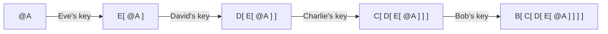

Then, **Alice** will send **encrypted output** to **Bob** through **service**.
**Bob** knows, that received **encrypted output** is encrypted with his RSA
public key, so he will decrypt it using his secret key:

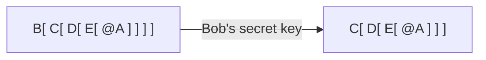

Then **Bob** will encrypt his **output** with his public keys:

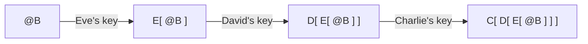

Then, **Bob** will shuffle them, and  send **encrypted outputs** to **Charlie** through **service**.

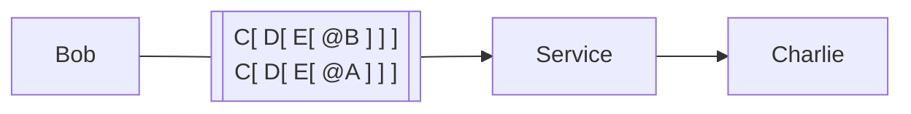

**Charlie** will decrypt it's upper layers with her secret key:

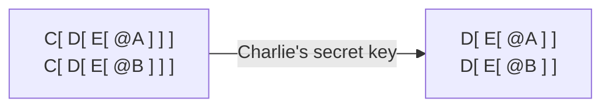

Then **Charlie** will encrypt her **output** with her public keys:

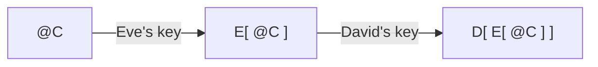

Shuffle them, and send to **David**:

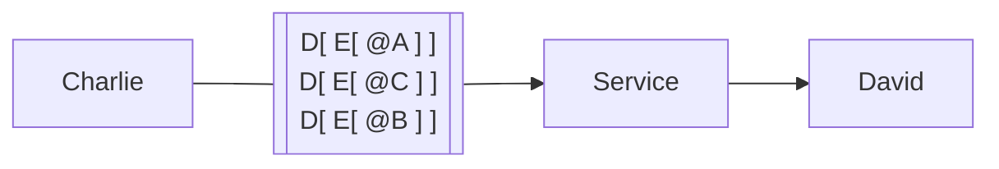

The process will continue until **Eve** will receive **encrypted outputs** from
**David**. **Eve** will finally get fully decrypted **outputs** from all
participants:

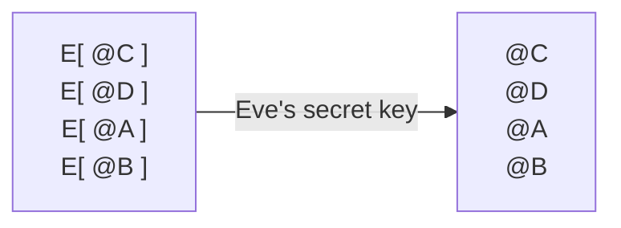

**Eve** will send that **outputs** to **service**, **service** will
form transaction with all **inputs** and **outputs**, and send it to
all participants for signing.

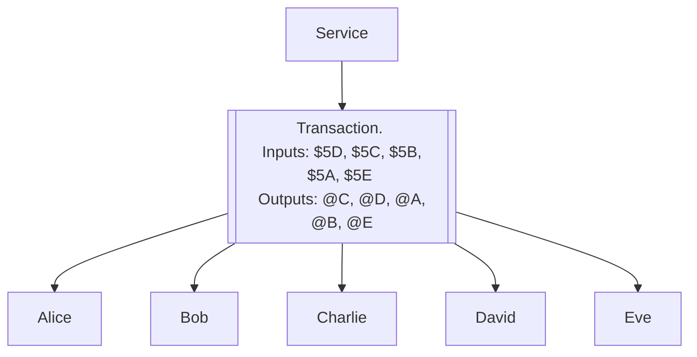

Each participant will see, that transaction is valid and at least contains
their input and output, so they will sign it and send it back to **service**.

The **service** will gather all required signatures, and then send it to the network.
